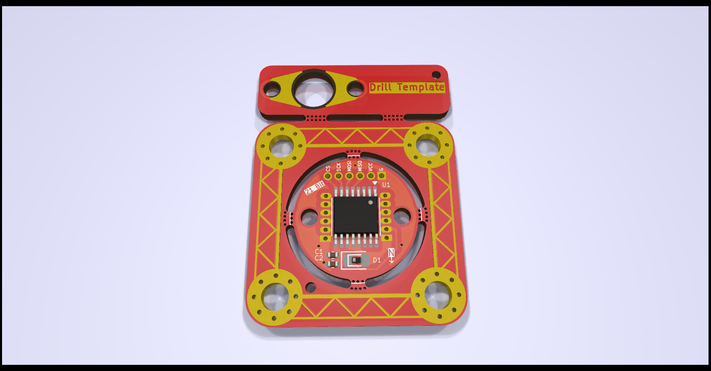
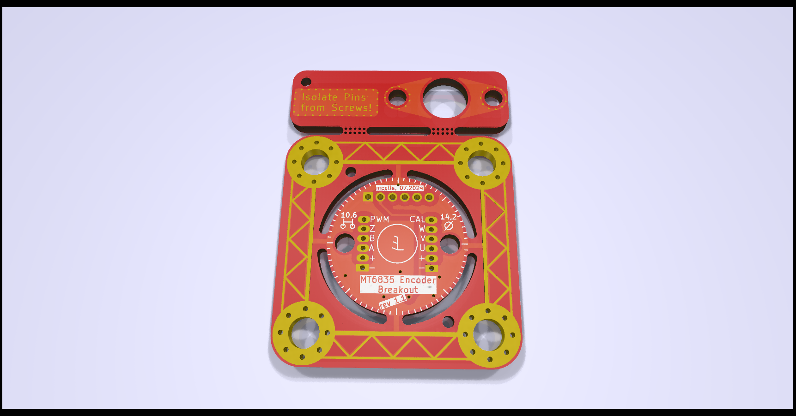

# mt6835-hoverboard-motor
MT6835 Breakout board, eg. for mounting inside Hoverboard motors

| Front | Back |
| ----- | ---- | 
|  |  |

## Features
- MT6835 Encoder
- 25x25mm diagonal M3 mounting holes that are removable by breakaway sections
- 14.2mm diameter, making it small enough to (hopefully) fit onto the 15mm shaft of Hoverboard motors
- M2 mounting holes, 10.6mm apart to facilitate mounting.
  - Nonconductive screws or spacers are necessary to prevent shorts!
  - Designed to be screwed into corresponding M2 holes drilled and tapped into the shaft, the cabling will go through the drilled-out center of the shaft.
  - A similar approach is described [here](https://community.simplefoc.com/t/a-project-in-mind-force-feedback-wheel/952/27)
- Breakaway drill template
  - drill out the motor shaft to 5mm and use the drill bit to locate the template on-center, then mark and drill the M2 holes
- All usable Pins broken out to three sensible 6-pin headers
  - SPI interface on 1.27mm header, with enough space to mount a 6-pin 1.25mm Molex Picoblade
  - UVW and ABZ (together with CAL and PWM pins) on 1mm Pitch headers (due to space constraints)
- TVS diode footprint can accept the one from the breakout board commonly available on Aliexpress
- Sleek design
## Renders
| Front | Back |
| ----- | ---- | 
|  |  |

## Installation inside a Hoverboard motor

Installing the sensor board inside a Hoverboard motor requires you to have access to the following tools:
- A Hoverboard motor and
- A sensor board (obviously...)
- A drill press (though using a hand drill might work, if you are careful)
- 5mm HSS drill
- 2mm HSS drill for marking the locating holes
- 1,6mm or 1,7mm HSS drill for the M2 threads
- M2 tap
- two M2 screws for mounting the sensor
- soldering stuff
- a saw or dremel to cut out the round part of the PCB

### Steps

| Step | Image | Description |
| ---- | ----- | ----------- |
|   1  |       | Disassemble the Motor, until you have just the bare Stator. Desolder and pull out all wires, so you can drill through the shaft.|
|   2  |  | Drill a 5mm Hole inside the top of the stator shaft. There is a centered "dimple" already in the shaft, which helps with centering the drill enormously. You have to drill about 25mm until you break through to the hollow shaft. |
|   3  |  | Remove the drill bit from the drill and put it most of the way through the new hole, so that just protrudes at the top. Use the drill bit to locate the template PCB on the center of the shaft. | 
|   4  |  | Using a M2 drill bit, pre drill two "dimples", so you can later locate with the smaller drill bit. When drilling the second dimple, use something like a small allen wrench in the first dimple to hold the template in place. |
|   5  |  | Drill the two holes with a 1.6mm or 1.7mm bit and tap the holes to M2. You can use a 1.7mm drill to ease the tapping, as the threads don´t need to support any significant load. Also refrain from tapping more than a few mm deep, as it is absolutely not neccesary and just increases the risk of your tap snapping off. |
|   6  |  | You can now mount the sensor. Take care to use either 3d printed isolators like I did, or use plastic washers. Else you **will short** the sensor out! I had to drill out the 5mm hole to 6mm to make my sensor wires fit. If you have thinner wires, 5mm might be enough for you. |
|  7 (optional) |  | In these motors, the 3 phases are each wound using multiple strands of enamelled copper wire, some 3, 4, or even 5 in parallel. The phases are then connected in a star, or Y topology. I wanted to lower the kV as much as possible, so I unsoldered the strands and connected them in series for each of the three phases. This lowers the kV by the number of strands you serialize, in my case three. |
|  8   |    |  My motors have just enough space inside, so that the magnet can be mounted directly inside the rotor bell. I marked the center of the bell by pushing a 15mm HSS drill into the bearing (15mm inside diameter) and turning the bell. This leaves a perfectly centered dimple exactly where you want to mount the magnet. The aluminium there is about 2-3mm thick. Drilling about 1mm with a drill bit of the same diameter as your magnet lets you just glue the magnet there, without drilling from the outside. |

## Where to get the boards

I got my PCBs fabbed and assembled at JLC. You can use the provided KiCad project files to generate the required files.
You don´t have to get assembled boards directly, as I designed the PCBs so that you can desolder the components from the aliexpress board and solder them onto this PCB. This might be far cheaper for single quantities.

If you have any questions, feel free to just create an issue/discussion or ask me on Discord (@hollowedbethyname)