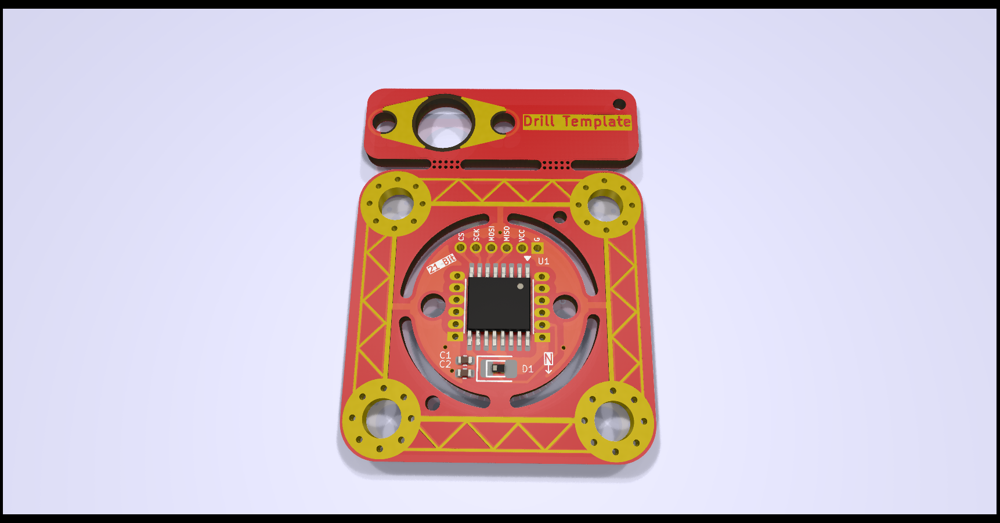

# mt6835-hoverboard-motor
MT6835 Breakout board, eg. for mounting inside Hoverboard motors

## Features
- MT6835 Encoder
- 14.2mm diameter, making  it small enough to (hopefully) fit onto the 15mm shaft of Hoverboard motors
- M2 mounting holes, 10.6mm apart to facilitate mounting.
  - Nonconductive screws or spacers are necessary to prevent shorts!
  - Designed to be screwed into corresponding M2 holes drilled and tapped into the shaft, the cabling will go through the drilled-out center of the shaft.
- All usable Pins broken out to three sensible 6-pin headers
  - SPI interface on 1.27mm header, with enough space to mount a 6-pin 1.25mm Molex Picoblade
  - UVW and ABZ (together with CAL and PWM pins) on 1mm Pitch headers (due to space constraints)
- TVS diode footprint can accept the one from the breakout board commonly available on Aliexpress
- Sleek design
## Images

